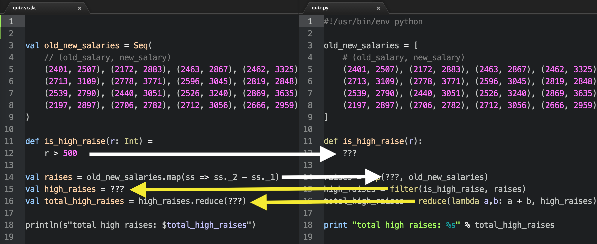

You have two identical scripts, one is written using Scala, while the other is written using Python. Several code snippets has been removed (replaced by `???`)

# Required
Simply open both files `quiz.scala` and `quiz.py`.


Implement the missing code snippets:
- `quiz.scala` line 12 (by translating from `quiz.py` line 12)
- `quiz.scala` line 14 (by translating from `quiz.py` line 14)
- `quiz.py` line 15 (by translating from `quiz.scala` line 15)
- `quiz.py` line 16 (by translating from `quiz.scala` line 16)

So that both programs work and prints the same output.

# Expected output
## Python
```
> ./quiz.py
total high raises: 5358
```
## Scala
```
> scala quiz.scala
total high raises: 5358
```

# Installation
You will need [Python 2.7](https://www.python.org/downloads/), [Java runtime](http://www.oracle.com/technetwork/java/javase/downloads/jre8-downloads-2133155.html), and [Scala](http://www.scala-lang.org/download/install.html) to be installed on your machine to run the code.

If you use Linux or OSX chances that you already have Python installed.


# Tutorials
- [Python: Lambda, filter, reduce and map](http://www.python-course.eu/lambda.php)
- [Scala basics](https://twitter.github.io/scala_school/basics.html) (Stop before Partial application)
- [Scala tuples](http://alvinalexander.com/scala/scala-tuple-examples-syntax) (Stop before "Use variable names to access tuple elements")
